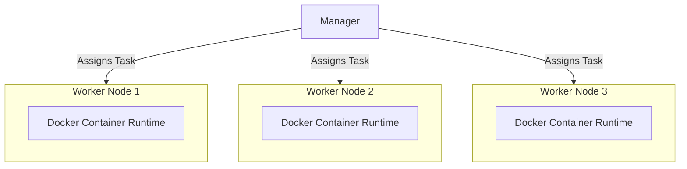

## Usage:
```bash
Cube is a CLI tool for orchestrating tasks across a distributed system.
It assigns tasks to worker nodes, which execute them in Docker containers.
With Cube, you can efficiently manage, monitor, and scale tasks across multiple nodes.

Usage:
  cube [command]

Available Commands:
  completion  Generate the autocompletion script for the specified shell
  help        Help about any command
  manager     Manager command to operate a Cube manager
  node        Node command to list nodes.
  run         Run a new task.
  status      Status command to list tasks.
  stop        Stop a running task.
  worker      Worker command to operate a Cube worker node.

Flags:
  -h, --help     help for cube
  -t, --toggle   Help message for toggle

Use "cube [command] --help" for more information about a command.
```
